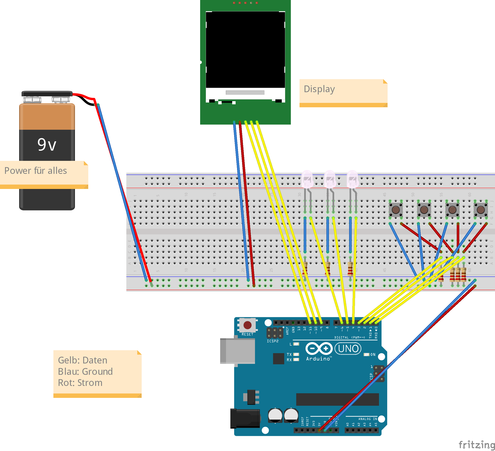
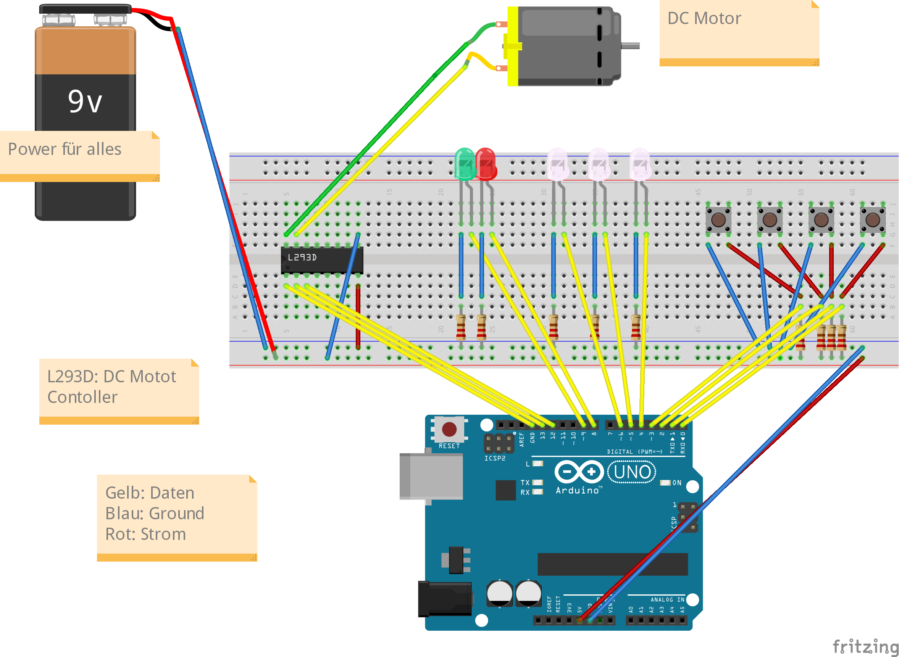
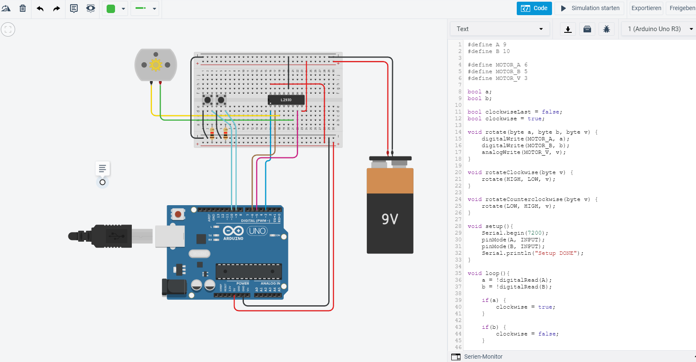

## Präsentation: Thermometer

[Link zu Präsentaion, Code und Erklärung](https://mnlmrngl.github.io/FundmentalsOfIOT/Thermometer%20with%20termistor)

## 

GitHub Pages Link: [https://mnlmrngl.github.io/FundmentalsOfIOT/](https://mnlmrngl.github.io/FundmentalsOfIOT/)

## Task 1

Grobentwurf: [Grobentwurf von ArduinoAvengers BatteryBrothers](https://mnlmrngl.github.io/FundmentalsOfIOT/ArduinoAvengers_BatteryBrothers_Grobentwurf.pdf)

## Task 2

Game Master - Interaktiver Prototyp: [Game Master - Interaktiver Prototyp](https://www.figma.com/proto/K9vJf8h62jGfA8uCMdBjYM/IoT-Game-Master-v01?node-id=1%3A62&viewport=134%2C157%2C0.155972421169281&scaling=min-zoom&page-id=0%3A1)

Spieler - Interaktiver Prototyp: [Spieler - Interaktiver Prototyp](https://www.figma.com/proto/OP6040JL8D7NB1fCvU2svN/IoT-Spieler-v01?node-id=1%3A38&viewport=1254%2C530%2C1.4709043502807617&scaling=min-zoom&page-id=0%3A1)

Use-Case-Diagram: [Use-Case-Diagram](https://mnlmrngl.github.io/FundmentalsOfIOT/02_use_case_diagramm.pdf)

## Task 3
Schaltplan für Gamemaster  

Schaltplan für Spieler  

## Taks 4
Schaltplan und Code, um Motor in zwei Richtungen zu derehen

Formel zur Berechnung, wie lange der Motor sich drehen muss, damit er das Papier um X cm bewegt  
  
s = Strecke, die das Papier zurücklegen soll in m  
x = Umdrehungen pro Minute des Motors  
r = Raduis der Rolle inkl Paper in m
